# 📚 Sistem Perpustakaan Online

Aplikasi web untuk mengelola perpustakaan secara online. Pengguna bisa melihat daftar buku dan meminjam buku, sementara admin bisa menambah, mengubah, dan menghapus buku.

---

## 👨‍💻 Informasi Mahasiswa

| Keterangan | Detail |
|------------|--------|
| **Nama** | Mahasiswa |
| **NIM** | 20230140094 |
| **Kelas** | A |
| **Mata Kuliah** | Pengembangan Aplikasi Web |
| **Tugas** | Remedial UTS |

---

## 📸 Tampilan Aplikasi

### Halaman Utama (Dashboard)
Halaman pertama saat membuka aplikasi. Menampilkan selamat datang dan tombol untuk menjelajahi buku.

**Tampilan User:**
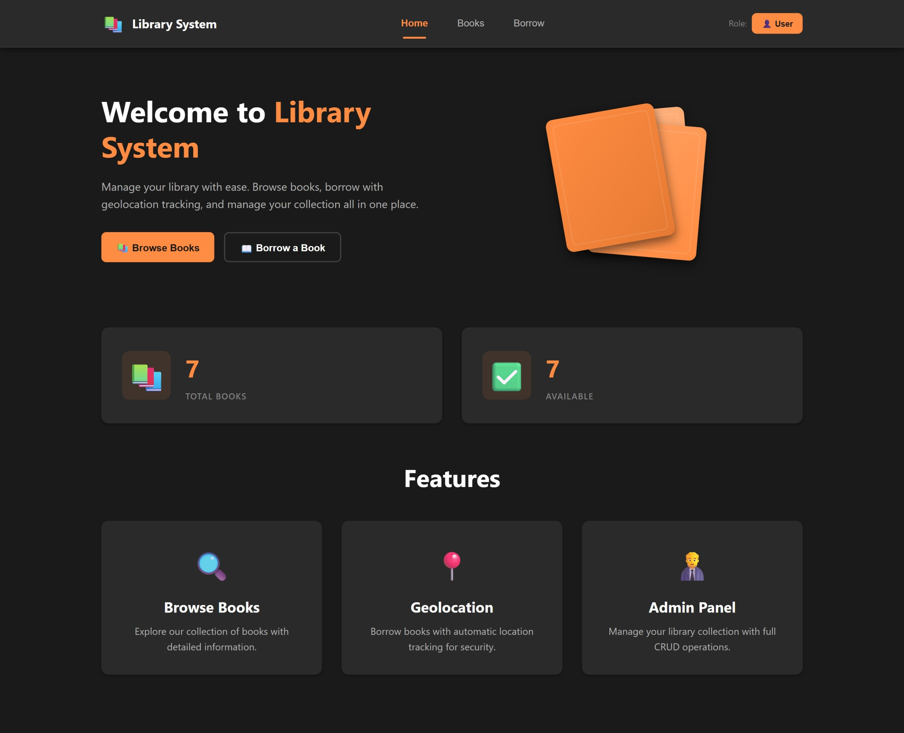

**Tampilan Admin:**


---

### Halaman Daftar Buku
Menampilkan semua buku yang tersedia di perpustakaan.

**Tampilan User:**
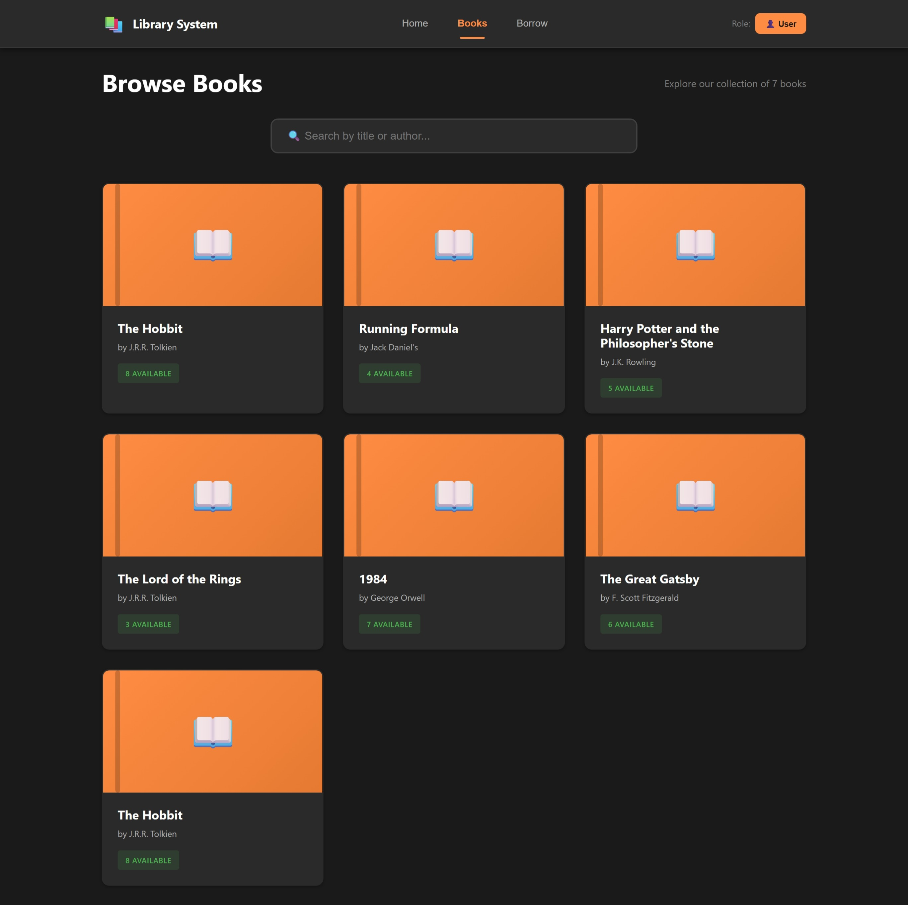

**Tampilan Admin:**


---

### Halaman Detail Buku
Menampilkan informasi lengkap tentang sebuah buku.

**Tampilan User:**
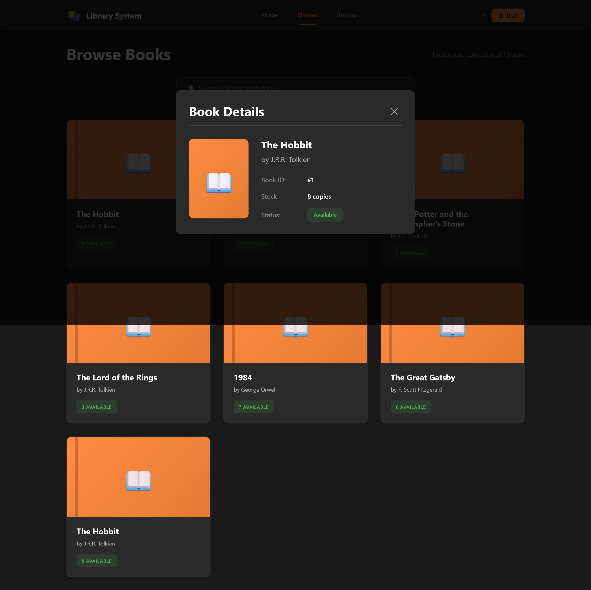

**Tampilan Admin:**


---

### Halaman Tambah Buku (Khusus Admin)
Admin bisa menambahkan buku baru ke perpustakaan.

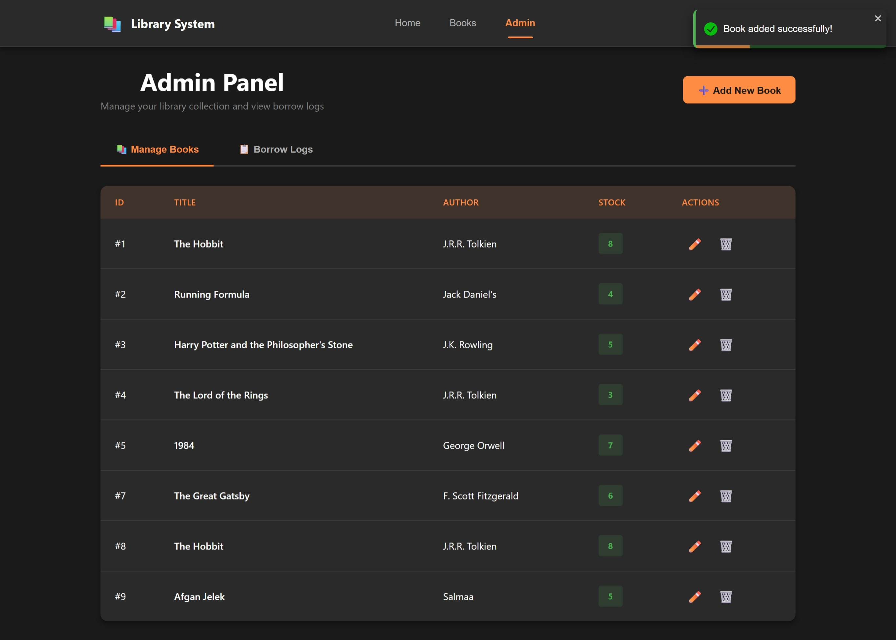

---

### Halaman Peminjaman Buku
User bisa meminjam buku dengan memasukkan nama dan memilih buku.

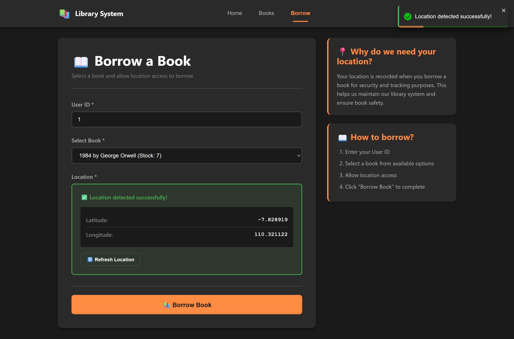

---

### Halaman Riwayat Peminjaman (Khusus Admin)
Admin bisa melihat semua catatan peminjaman buku.

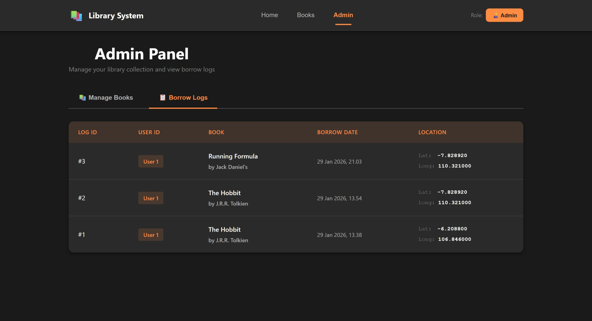

---

## 🔌 Pengujian API dengan Thunder Client

Berikut adalah hasil pengujian API menggunakan Thunder Client:

### Mengambil Semua Buku (GET All)
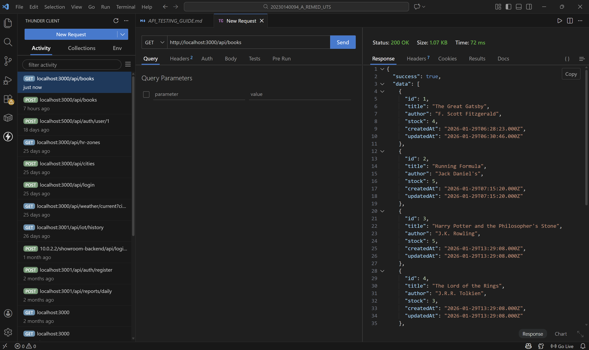

### Mengambil Buku Berdasarkan ID (GET by ID)
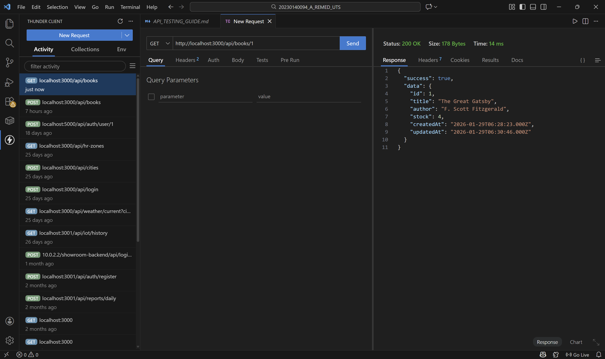

### Menambah Buku Baru (POST)
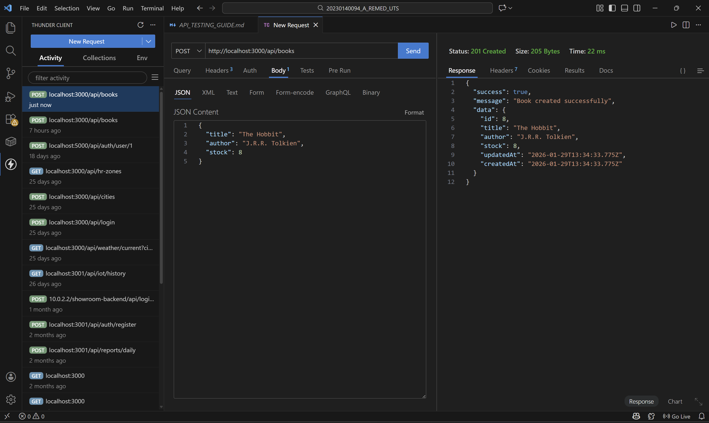

### Mengubah Data Buku (PUT)
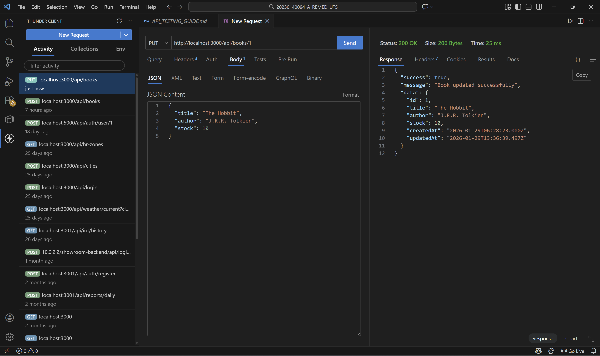

### Menghapus Buku (DELETE)
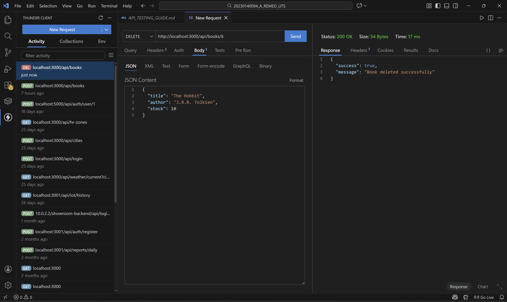

### User Meminjam Buku (POST Borrow)
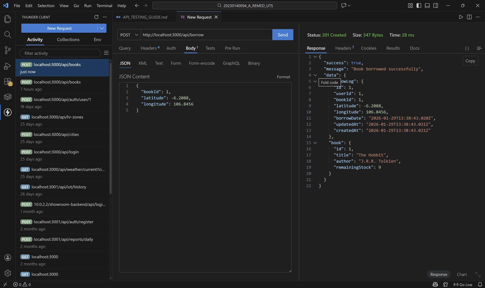

---

## 🗄️ Struktur Database

### Tabel Books (Daftar Buku)
Menyimpan data semua buku di perpustakaan.

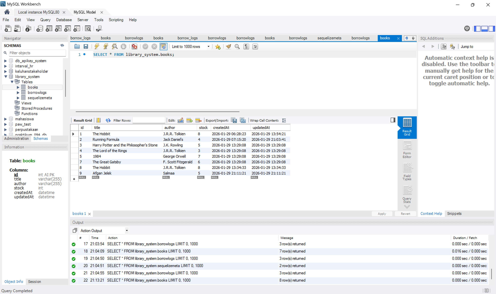

### Tabel Borrow Logs (Catatan Peminjaman)
Menyimpan catatan siapa meminjam buku apa dan kapan.

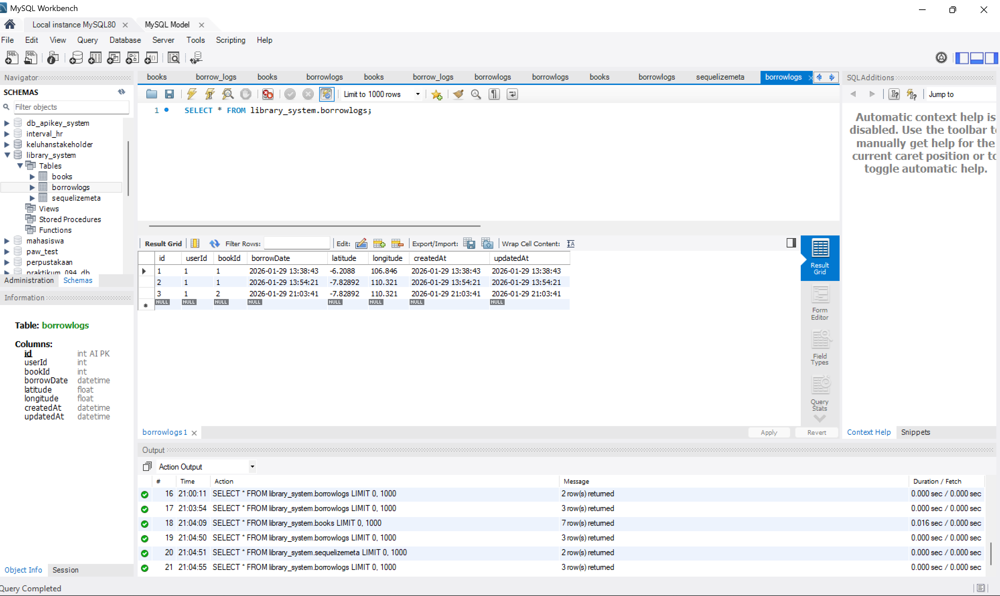

---

## 🛠️ Cara Menjalankan Aplikasi

### Yang Dibutuhkan
- Node.js (versi 14 ke atas)
- MySQL (berjalan di port 3307)
- Database dengan nama `library_system`

### Langkah 1: Siapkan Database
1. Buka MySQL dan buat database baru:
   ```sql
   CREATE DATABASE library_system;
   ```

### Langkah 2: Jalankan Server (Backend)
1. Buka folder `server` di terminal
2. Jalankan perintah berikut:
   ```bash
   # Pasang semua yang dibutuhkan
   npm install
   
   # Buat tabel-tabel di database
   npx sequelize-cli db:migrate
   
   # Isi data contoh (5 buku)
   npx sequelize-cli db:seed:all
   
   # Jalankan server
   npm run dev
   ```
3. Server akan berjalan di `http://localhost:3000`

### Langkah 3: Jalankan Client (Frontend)
1. Buka folder `client` di terminal baru
2. Jalankan perintah berikut:
   ```bash
   # Pasang semua yang dibutuhkan
   npm install
   
   # Jalankan aplikasi
   npm start
   ```
3. Aplikasi akan terbuka di `http://localhost:3001`

---

## 📂 Struktur Folder Project

```
📦 20230140094_A_REMED_UTS
├── 📁 client/              # Aplikasi tampilan (Frontend)
│   ├── 📁 public/          # File HTML utama
│   └── 📁 src/             # Kode React
│       ├── 📁 components/  # Bagian-bagian tampilan
│       ├── 📁 pages/       # Halaman-halaman aplikasi
│       └── 📁 services/    # Penghubung ke server
│
├── 📁 server/              # Aplikasi server (Backend)
│   ├── 📁 config/          # Pengaturan database
│   ├── 📁 controllers/     # Logika aplikasi
│   ├── 📁 middleware/      # Pengecekan role user
│   ├── 📁 migrations/      # Pembuatan tabel
│   ├── 📁 models/          # Struktur data
│   ├── 📁 routes/          # Daftar URL API
│   └── 📁 seeders/         # Data contoh
│
└── 📁 screenshot/          # Gambar tampilan aplikasi
```

---

## 🔗 Daftar API

### Untuk Semua Pengguna
| Aksi | URL | Keterangan |
|------|-----|------------|
| Lihat semua buku | `GET /api/books` | Mengambil daftar semua buku |
| Lihat detail buku | `GET /api/books/:id` | Mengambil info satu buku |
| Pinjam buku | `POST /api/borrow` | Meminjam buku |

### Khusus Admin
Tambahkan header `x-user-role: admin` saat request.

| Aksi | URL | Keterangan |
|------|-----|------------|
| Tambah buku | `POST /api/books` | Menambah buku baru |
| Ubah buku | `PUT /api/books/:id` | Mengubah data buku |
| Hapus buku | `DELETE /api/books/:id` | Menghapus buku |

---

## 🎨 Fitur Aplikasi

### Untuk User (Pengunjung)
- ✅ Melihat daftar semua buku
- ✅ Melihat detail buku
- ✅ Meminjam buku dengan memasukkan nama

### Untuk Admin
- ✅ Semua fitur user
- ✅ Menambah buku baru
- ✅ Mengubah data buku
- ✅ Menghapus buku
- ✅ Melihat riwayat peminjaman

---

## 💻 Teknologi yang Digunakan

### Frontend (Tampilan)
- React.js - Framework untuk membuat tampilan
- Axios - Untuk menghubungi server
- React Toastify - Untuk menampilkan notifikasi

### Backend (Server)
- Express.js - Framework untuk membuat server
- Sequelize - Untuk mengelola database
- MySQL - Tempat menyimpan data

---

## 📝 Catatan Penting

1. Pastikan MySQL berjalan di port **3307** (atau ubah di `server/config/config.json`)
2. Untuk mengakses fitur admin, klik tombol "Beralih ke Admin" di navbar
3. Password database default adalah `1523` (bisa diubah di config)

---

Dibuat dengan ❤️ untuk tugas Remedial UTS Pengembangan Aplikasi Web
